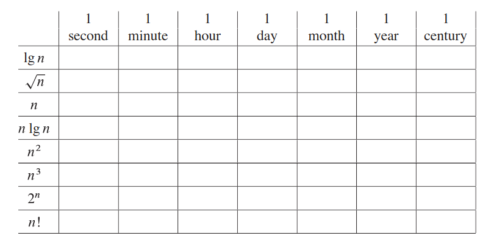

# 1-1 Comparison of running times

For each function f(n) and time t in the following table, determine the largest size n of a problem that can be solved in time t , assuming that the algorithm to solve the problem takes f(n) microseconds.  

*f(n)* = time_in_microseconds  
log2n = 106 "this is one second in microseconds"   
n = 2106  

A problem with input size n = 2106 (where 106 is the amount of microseconds in a second) would take one second to be solved with an algorithm that has time efficiency log2n.  
This is the solution for the first row, first column. I'm not going to do this for every cell, but the logic stays the same for all.  

